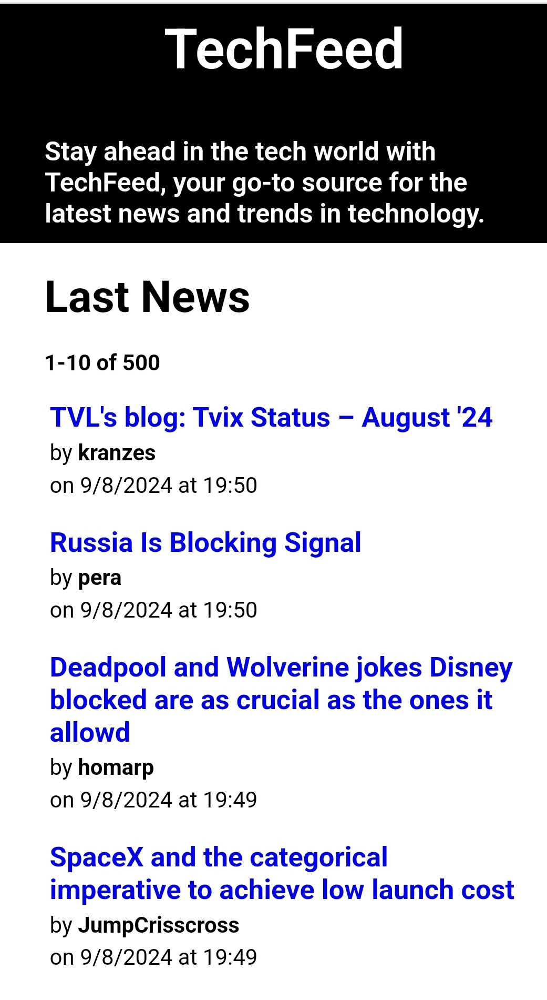

# TECHFEED

App to share tech related news. Created by Andrea Brandetti frontend developer using HackerNews API data.

How it works:

The app has access to 500 tech news. At the start the last 10 of them will be automatically displayed. If the user press/clicks the "Load More" button the app will display other 10 news, then it will appear the "Load Less" button that, if pressed, will cancel the last group of news displayed.

Build command:

- npm run build
- yarn build

Change personal key on .env.example e rename the file as .env to test the app.

Built With:

- HTML
- CSS
- JavaScript
- webpack
- RapidAPI

Deployed With:

- Netlify

Links:

- Github repo: https://github.com/brandijsen/tech-feed
- Url: https://scintillating-sunflower-eadfb3.netlify.app/
